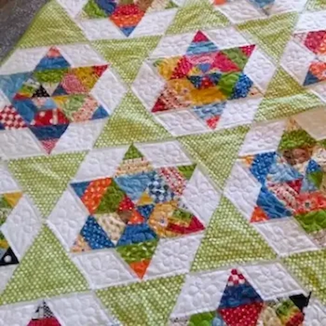

# Overview

This project is a web application I built to deepen my skills as a software engineer by designing a small, full-stack-capable website that demonstrates front-end interactivity, client-side form validation, and simple server-side form handling. The goal was to practice building an accessible, responsive content site with a gallery and contact flow while using plain HTML, CSS, JavaScript, and minimal PHP for form submission.

The app is a small quilting-creation site that serves a landing page, a gallery of quilting patterns loaded from JSON, and a contact form that posts to a PHP endpoint. To run a local test server (recommended so the PHP form handler works), open PowerShell, change to the project folder, and run:

```
cd "c:\Users\UtahH\OneDrive\Desktop\aquiltingcreation"
php -S localhost:8000
```

Then open `http://localhost:8000/index.html` in your browser to see the app's first page.

If you only need to preview static pages and don't plan to submit the form, you can also use the VS Code Live Server extension or run a static HTTP server (for example `python -m http.server 8000`). Note that the PHP form handler (`submit_form.php`) requires a PHP-capable server.

The purpose of writing this software was to practice building a small web project end-to-end: structuring static assets, dynamically loading JSON-driven content into the UI, validating forms client-side, and handling a basic server-side submission endpoint.

[Software Demo Video](http://youtube.link.goes.here)

# Web Pages

- **`index.html` (Landing page):** The site's entry point. It describes the site and includes navigation links to the gallery and contact pages. The header/navigation persists across pages (via consistent markup and shared CSS). The landing page contains static content and calls into shared CSS (`styles/base.css` and `styles/quilt.css`) and `scripts/forms.js` for any client-side behaviors.

- **`gallery.html` (Gallery page):** Displays quilting patterns and thumbnails. The page uses `scripts/gallery.js` to fetch `data/patterns.json` (and/or `data/items.json`) and dynamically create the gallery grid of items and their metadata (title, description, thumbnail paths in `images/`). Clicking an item may open a larger image or navigate to a detail view (implemented in-page via dynamic DOM updates or modal behavior implemented in `gallery.js`).

- **`contact.html` (Contact / Submit page):** Contains a contact form that uses `scripts/forms.js` for client-side validation and `scripts/custom-captcha.js` for a lightweight captcha. On submit, the form POSTs to `submit_form.php` which handles the form server-side (email or log depending on server configuration). The page provides success/failure feedback to the user after submission.

- **`submit_form.php` (Server endpoint):** A minimal PHP script that accepts POSTed form data from `contact.html`, performs server-side validation, and then either emails the submission or writes it to a file (configuration dependent). This file requires running the PHP built-in server or a PHP-capable web server to operate.

Transitions: navigation links in the header move users between `index.html`, `gallery.html`, and `contact.html`. The gallery is dynamically populated by reading `data/patterns.json` using the Fetch API in `scripts/gallery.js`. Form submission triggers client-side validation in `scripts/forms.js` and then posts to `submit_form.php` for server-side handling.

# Development Environment

- **Editor / Tools:** Visual Studio Code, Git (for version control), modern web browsers (Chrome, Edge, Firefox) for testing, Windows PowerShell as the development shell.
- **Local server:** PHP (for `submit_form.php`) — the PHP built-in server (`php -S`) is the recommended way to test the form handler locally. For static previews, VS Code Live Server or Python's `http.server` can be used.
- **Languages:** HTML, CSS, JavaScript, PHP.
- **Libraries / Frameworks:** No external JavaScript frameworks were required; the project uses vanilla JavaScript and the browser Fetch API. CSS is custom (no CSS frameworks included). If you add tooling later, Node-based build tools could be introduced, but are not necessary for the current code.

# Useful Websites

* [MDN Web Docs — HTML, CSS, JavaScript](https://developer.mozilla.org/)
* [PHP Manual](https://www.php.net/manual/en/)
* [Stack Overflow](https://stackoverflow.com/)
* [W3C — HTML & Accessibility Guidelines](https://www.w3.org/)

# Future Work

* Improve responsive layout and test across more viewport sizes.
* Add stronger server-side validation and sanitize all inputs in `submit_form.php`.
* Replace the placeholder form submission handling with a persistent datastore (database) instead of file/email, if desired.
* Improve accessibility (ARIA attributes, keyboard navigation, color contrast checks).
* Add unit or integration tests for JS modules and end-to-end test for form submission.
* Add search, filtering, and pagination for the gallery if the item list grows.
# 🧵 A Quilting Creation 🪡

Welcome to **A Quilting Creation** — a website for the longarm sewing business by Christi Dobbins!  
Here, quilting dreams are stitched into reality, one patch at a time.


---

## ✨ Features

- 🖼️ **Gallery:** Explore beautiful quilt designs and finished projects.
- 📝 **Custom Design Form:** Submit your own quilt ideas and preferences.
- 📅 **Inquiry Tracking:** Review your submitted requests and details.
- 📱 **Responsive Design:** Looks great on any device.
- 🔒 **Secure Contact:** Google reCAPTCHA keeps your submissions safe.

---

## 🚀 Getting Started

1. **Clone or Download** this repository.
2. Open `index.html` in your browser to explore the site.
3. To submit a custom quilt request, use the **Design** form.
4. All styles and scripts are in the `styles/` and `scripts/` folders.

## Running the app with Node (Express)

I added a minimal Node + Express server to render the gallery server-side and store orders in SQLite. I only changed the e-commerce flow files and added server files; all other pages remain unchanged.

Quick setup (run in PowerShell from the project folder):

```powershell
cd "c:\Users\UtahH\OneDrive\Desktop\aquiltingcreation"
npm install
npm start
```

Then open `http://localhost:8000/gallery` to view the server-rendered gallery. The server also exposes a POST `/order` endpoint used by the gallery to save order data into `data/orders.db`.

Notes:
- The server uses `ejs` for templating and `better-sqlite3` for a lightweight SQLite DB. If you don't want Node, you can stop the server and the static pages still work.
- I kept a mailto fallback in `scripts/gallery.js` if saving the order to the server fails.

---

## 🛠️ Tech Stack

- HTML5, CSS3 (with Bootstrap 5)
- JavaScript (vanilla)
- PHP (for form handling)
- Google reCAPTCHA

---

## 📸 Gallery Preview




---

## 📬 Contact

- Email: [Christina.Dobbina@gmail.com](mailto:Christina.Dobbina@gmail.com)

---

> _Stitches of love, patches of dreams, quilts tell stories through fabric seams._

---

© 2025 Christi Dobbins | A Quilting Creation
 
---

## 📦 Patterns schema (data/patterns.json)

This project uses `data/patterns.json` to populate the pattern selector on the Design/Contact page.
The canonical fields are listed below — keep these fields and types consistent when adding or editing patterns:

- `id` (string) - unique identifier used in the HTML <option> value
- `name` (string) - visible name in the dropdown and descriptions
- `image` (string) - path to the thumbnail image (e.g. `images/thumb1.webp`)
- `imageWidth` (number, optional) - thumbnail width (px)
- `imageHeight` (number, optional) - thumbnail height (px)
- `description` (string) - short description for the pattern
- `pricePerSquareInch` (number) - canonical price per square inch for calculator (e.g., `0.020`)

Example entry:
```json
{
	"id": "pattern1",
	"name": "Daisy Delight",
	"image": "images/thumb1.webp",
	"imageWidth": 44,
	"imageHeight": 44,
	"description": "Charming daisies and leaves.",
	"pricePerSquareInch": 0.020
```

### Numeric vs String price fields — What to use and why

- Use `number` for `pricePerSquareInch`: The cost calculator in `scripts/form.js` performs numeric calculations (area * price). Keeping the price as a number makes it straightforward and avoids unnecessary parsing.
- If you convert prices to strings (e.g. `"$0.02"` or `"0.02"`), your JavaScript must parse those strings back into numbers using `parseFloat()` or similar — this increases opportunities for bugs (e.g. `"$0.02"` needs the `$` removed) and currency formatting gets mixed with data.
- If you want to store human-readable formats (e.g. `"$0.02"`) keep a dedicated `displayPrice` or `formattedPrice` key for UI only, and leave `pricePerSquareInch` numeric for calculations.

Example for both fields:
```json
{
	"pricePerSquareInch": 0.020,
	"formattedPrice": "$0.020" // used only for display on the page
}
```

---

If you'd like, I can:
- Add a small `scripts/validatePatterns.js` to automatically check `data/patterns.json` (and add a GitHub Action workflow to run it on PRs), or
- Convert all numeric values to strings and update scripts to parse them consistently (not recommended unless you need localized display formats in JSON).

Tell me which you prefer and I can add the validation script and/or CI workflow for you.

## Learning & Annotations

- I annotated project files with beginner-friendly comments and added sidecar notes for JSON data. The annotation style aims to explain "what this file does", "why I wrote it this way", and "what I learned / would improve".
- Files annotated inline: `index.html`, `gallery.html`, `contact.html`, `scripts/forms.js`, `scripts/gallery.js`, `scripts/custom-captcha.js`, `submit_form.php`, and CSS files in `styles/`.
- JSON files have sidecar annotation files: `data/items.json.annot.md` and `data/patterns.json.annot.md` (JSON does not allow comments).
- These annotations are intended to help reviewers understand the code, meet the module reflection requirements, and guide future refactors.

